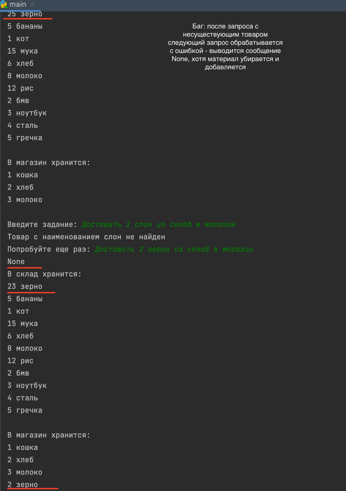
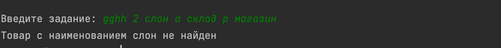

# SkyPro.Python course
## Homework 22. Classes.Peer review
Данная работа - рефакторинг работы Кирилла Павельева([cсылка на работу](https://github.com/kpaveliev/skypro-c05-hw21-classes.git)).

Было исправлено следующее:

1) **Реализация абстрактного класса Storage(assets.storage.py)**:
У Кирилла в данном классе только один метод абстрактный метод (__init__).
Я сделала все методы данного класса абстрактными и убрала бы реализацию методов, чтобы обеспечить единый интейфейс всех наследников.

2) **Имена переменных**. 
- Имя класса Store - на мой взгляд, данное имя не очень подходит для "склада", т.к. означает "магазин".
Я поменяла на Storehouse.

- Имя параметра title заменено на item (в значении 'наименование товара') везде, где он встречается.
```python
 # было
def remove(self, title: str, quantity: int) -> None:
        return super().remove(title, quantity)
# стало
def remove(self, item: str, quantity: int) -> None:
    return super().remove(item, quantity)
```
- Имя класса исключения MessageError(assets.exceptions.py) заменено на UserRequestError
- Имя параметра message класса Request заменено на user_request

3) **Избыточность кода** 
В некоторых кусках кода можно обойтись без генераторов и сделать код лаконичнее (мои исправления в комментариях к коду ниже)
 ```python
    # assets.storage.py Line 52
    def _get_unique_items_count(self) -> int:
        """Return number of unique goods stored"""
        # было: return len([item for item in self._items.keys()]) 
        # стало
        return len(self._items)
    
        
    # assets.storage.py Line 43
    def _get_free_space(self) -> int:
        """Get free space left in storage"""
        # было: taken_space = sum([item for item in self._items.values()])
        # стало 
        taken_space = sum(self._items.values())
        return self._capacity - taken_space
    
    
   # assets.storage.py Line 32 и Line 37
    def remove(self, title: str, quantity: int) -> None:
        """Decrease quantity of items stored

        :raises ItemsNotFound: If no items with the specified title found in storage
        :raises ItemsNotFound: If quantity requested exceeds quantity stored
        """
        # можно:  if title not in self._items
        if title not in self._items.keys(): 
            raise ItemsNotFound(f'Товар с наименованием {title} не найден')
        if quantity > self._items.get(title):
            raise ItemsNotFound(f'Нет нужного количества товара с наименованием {title}')
        
        # можно: self._items[title] -= quantity  поскольку проверки пройдены выше
        self._items[title] = self._items.get(title) - quantity
        if self._items[title] == 0:
            del self._items[title]

 ```

4) **Magic number**.

В данном коде есть магическое число - 5, несмотря на то, что даются пояснения в docstring.
```python
def add(self, title: str, quantity: int) -> None:
        """Increase quantity of items stored

        :raises StorageFull: if title in excess of 5 already stored is added
        """
        if self._get_unique_items_count() >= 5:  # magic number
            raise StorageFull('В магазине нельзя хранить более 5 наименований товаров')
        return super().add(title, quantity)
```
Я вынесла это число в поле класса Shop

``` python
# МОЙ ВАРИАНТ
class Shop(Storehouse):
    """Shop - any quantity of up to 5 titles could be stored within capacity"""
    _item_limit = 5

    def __init__(self):
        super().__init__()
        self._capacity: int = 20

    @classmethod
    def _get_item_limit(cls):
        return cls._item_limit

    def add(self, title: str, quantity: int) -> None:
        """Increase quantity of items stored

        :raises StorageFull: if title in excess of 5 already stored is added
        """
        if self._get_unique_items_count() >= self._get_item_limit():  # вместо magic number 5
            raise StorageFull('В магазине нельзя хранить более 5 наименований товаров')
        return super().add(title, quantity)
        
```

5) utils.py - функция send_request.
Обнаружен следующий баг:

Баг исправлен заменой return на print(то есть функция теперь не возвращает значение, а выводит его в терминал)


6) **Рефакторинг класса Request**

Обнаружен баг - приложение принимает и обрабатывает запрос от пользователя не только в требуемом формате

Для проверки входящего запроса от пользователя я использовала регулярное выражение

```python
# БЫЛО: 
# длинный код
# длинный код проверки валидности запроса пользователя
# комментарии

 from typing import Tuple, Any

from .exceptions import MessageError


class Request:
    """Process requests for item movement"""

    def __init__(self, storages: dict, message: str):
        """
        :param storages: dict with Store and Shop instances
        :param message: message example 'Доставить 3 печеньки из склад в магазин'
        """
        self._storages = storages
        self._message = message

        # split_message = Request._split_message(message)
        # self._product: str = split_message['product']
        # # self._from: str = split_message['from']
        # self._to: str = split_message['to']
        # self._amount: int = int(split_message['amount'])

    @property
    def message(self):
        return self._message

    @message.setter
    def message(self, value: str) -> None:
        Request._split_message(value)
        self._message = value

    @property
    def from_(self) -> str:
        # split_message = Request._split_message(self.message)
        return Request._split_message(self.message)['from']

    @property
    def to(self) -> str:
        return Request._split_message(self.message)['to']

    @property
    def product(self) -> str:
        return Request._split_message(self.message)['product']

    @property
    def amount(self) -> int:
        return int(Request._split_message(self.message)['amount'])

    @staticmethod
    def _split_message(message: str) -> dict:
        """Check message and get fields from it

        :raises MessageError: if incorrect message passed
        """
        # Check length
        message = message.split(' ')

        if len(message) < 7:
            raise MessageError('Некорректное сообщение')

        # Check fields
        split_message = {'from': message[4], 'to': message[6], 'amount': message[1], 'product': message[2]}
        if (
                split_message['from'] not in ['склад', 'магазин']
                or split_message['to'] not in ['склад', 'магазин']
                or not split_message['amount'].isdigit()
        ):
            raise MessageError('Вы ввели некорректное сообщение')

        return split_message

    def process(self) -> Tuple[Any, Any]:
        """Use Storage methods to manipulate data"""
        self._storages[self.from_].remove(self.product, self.amount)
        self._storages[self.to].add(self.product, self.amount)
        return self._storages[self.from_], self._storages[self.to]

    def __repr__(self):
        return f'from: {self.from_}, to: {self.to}, amount: {self.amount}, product: {self.product}'


# МОЙ ВАРИАНТ
# Длина кода уменьшена на 28 строк
# Проверка запроса пользователя через регулярное выражение вынесена в отдельный метод (self._validate_request)
# Параметр message переименован в user_request

class Request:
    """Process requests for item movement"""
    sample_request = 'Доставить 3 печеньки из склад в магазин'
    request_pattern = r'Доставить \d{1,} [а-яё]{1,} из (?:склад|магазин) в (?:склад|магазин)'

    def __init__(self, storages: dict, user_request: str):
        """
        :param storages: dict with Store and Shop instances
        :param message: message example 'Доставить 3 печеньки из склад в магазин'
        """
        self._storages = storages
        self._user_request = user_request.capitalize()
        try:
            self.product: str = self._split_request(self._user_request)['product']
            self.from_: str = self._split_request(self._user_request)['from']
            self.to: str = self._split_request(self._user_request)['to']
            self.amount: int = int(self._split_request(self._user_request)['amount'])
        except UserRequestError:
            print("Запрос не может быть создан")

    def _split_request(self, user_request: str) -> dict:
        """Splits user's request"""
        self._validate_request(user_request)
        user_request = user_request.split()
        split_request = {'from': user_request[4], 'to': user_request[6], 'amount': user_request[1], 'product': user_request[2]}
        return split_request

    def _validate_request(self, user_request: str):
        """raises MessageError: if incorrect message passed"""

        if not re.fullmatch(Request.request_pattern, user_request):
            raise UserRequestError('Вы ввели некорректное сообщение')

    def process(self) -> Tuple[Any, Any]:
        """Use Storage methods to manipulate data"""
        self._validate_request(self._user_request)
        self._storages[self.from_].remove(self.product, self.amount)
        self._storages[self.to].add(self.product, self.amount)
        return self._storages[self.from_], self._storages[self.to]

    def __repr__(self):
        try:
            self._validate_request(self._user_request)
            return f'from: {self.from_}, to: {self.to}, amount: {self.amount}, product: {self.product}'
        except UserRequestError:
            return 'Некорректный запрос'
```
